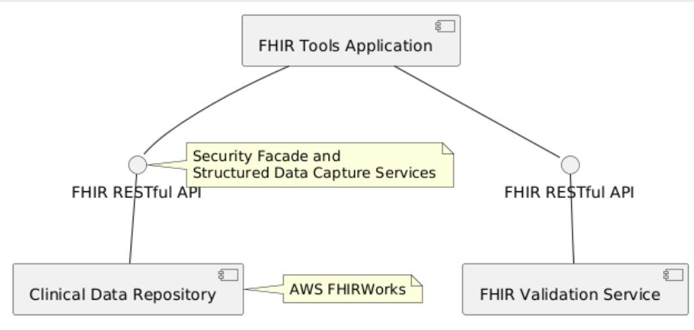

## FHIR Tools Skunkworks

Tools can be viewed on [FHIR Tools Skunkworks](https://nhsdigital.github.io/interoperability-standards-tools-skunkworks/)

### Validate (FHIR Validate)

Uses [FHIR Validation](https://hl7.org/fhir/R4/validation.html) to check conformance of FHIR resources. The configuration of the validator can be found in [Configuration](https://nhsdigital.github.io/interoperability-standards-tools-skunkworks/information)

### API Definition (OAS and FHIR CapabilityStatement)

This will 

- Display a FHIR CapabilityStatement or OAS using [swaggerUI](https://swagger.io/tools/swagger-ui/)
- OAS can be converted to FHIR CapabilityStatement
  - The conversion will also check for FHIR SearchDefinition's and add extra details if required.  
- FHIR CapabilityStatement can be converted to OAS
- This does not attempt to create an OAS schema and instead provides links to FHIR Conformace (e.g. UK Core) and FHIR schema downloads. 

### Form Defintition (FHIR Structured Data Capture)

- Renders a [FHIR Questionnare](https://hl7.org/fhir/R4/questionnaire.html) using open source component from [LHC FHIR Tools](https://lhcforms.nlm.nih.gov/)
  - Can be used to create an example [FHIR QuestionnaireResponse](https://hl7.org/fhir/R4/questionnaireresponse.html)
- Renders openEHR Archetype or Templates using [LHC FHIR Tools](https://lhcforms.nlm.nih.gov/) components
  - Can be used to convert to [FHIR Questionnare](https://hl7.org/fhir/R4/questionnaire.html) and [FHIR QuestionnaireResponse](https://hl7.org/fhir/R4/questionnaireresponse.html) examples
- Uses a [SDC Demonstration Server](http://lb-hl7-tie-1794188809.eu-west-2.elb.amazonaws.com/swagger-ui/index.html#/Structured%20Data%20Capture), this server can be used to explore [FHIR Structured Data Capture](https://build.fhir.org/ig/HL7/sdc/) API's. 

### Architecture 

This application provides a user interface to two FHIR Servers which provide:

- Clinical Data Repository provided by an [AWS FHIRWorks](https://github.com/aws-solutions/fhir-works-on-aws), this is surfaced via a security and SDC facade which handles cognito authentication and provides [Structured Data Capture](https://build.fhir.org/ig/HL7/sdc/index.html) capabilities - see [FHIR Integration Engine](https://github.com/NHSDigital/IOPS-FHIR-Integration-Engine).
- [FHIR Validation Service](https://github.com/NHSDigital/FHIR-Validation)
- An experimental service to convert openEHR to FHIR Questionnaire is provided by [IOPS openFHIR](https://github.com/NHSDigital/IOPS-openFHIR)

The application is an [Angular application](https://github.com/NHSDigital/FHIR-Validation) which includes use of several libaries such as 
- [@types/fhir](https://www.npmjs.com/package/@types/fhir) for working with HL7 FHIR objects.
- [Covalent Teradata](https://teradata.github.io/covalent/v8/#/) which builds on Angular Material.
